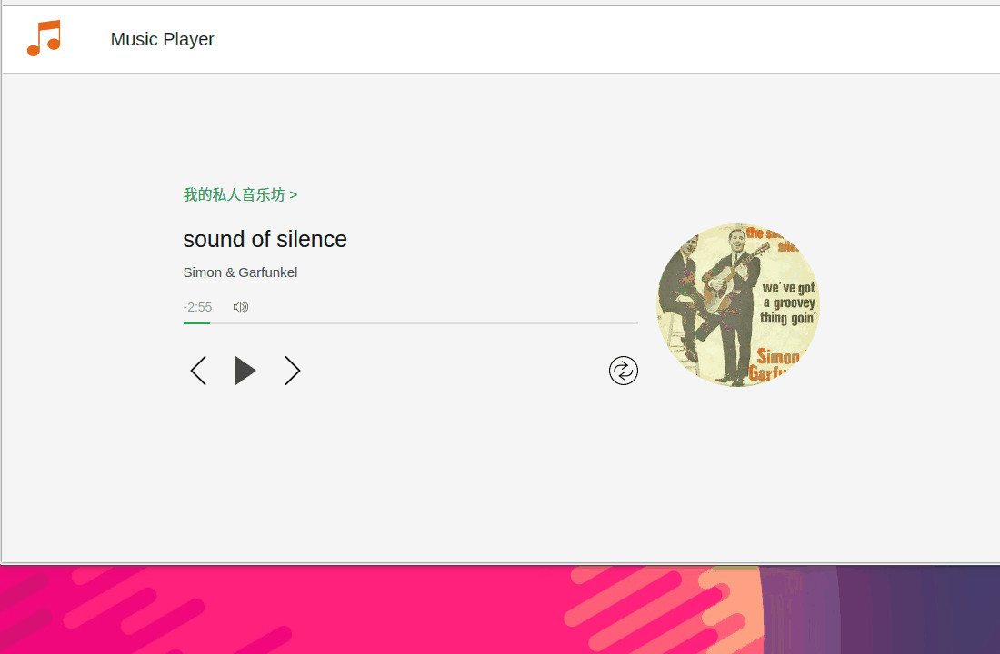

# React-MusicPlayer
React音乐播放器

## 效果图
 

## TODO
1.显示歌词

2.接入歌曲库，搜索播放

## Usage

```bash
# 下载代码
git clone https://github.com/zaizizaizai/MusicPlayer.git
# 进入项目目录，安装依赖
npm install
# 运行预览
npm start
# 开发模式
node server
```

## 参考学习
课程视频：[http://www.imooc.com/learn/868](http://www.imooc.com/learn/868)

课程github：[https://github.com/xiaolin3303/react-music-player](https://github.com/xiaolin3303/react-music-player)

other github:
[https://github.com/junhey/React-Music-Player](https://github.com/junhey/React-Music-Player)
